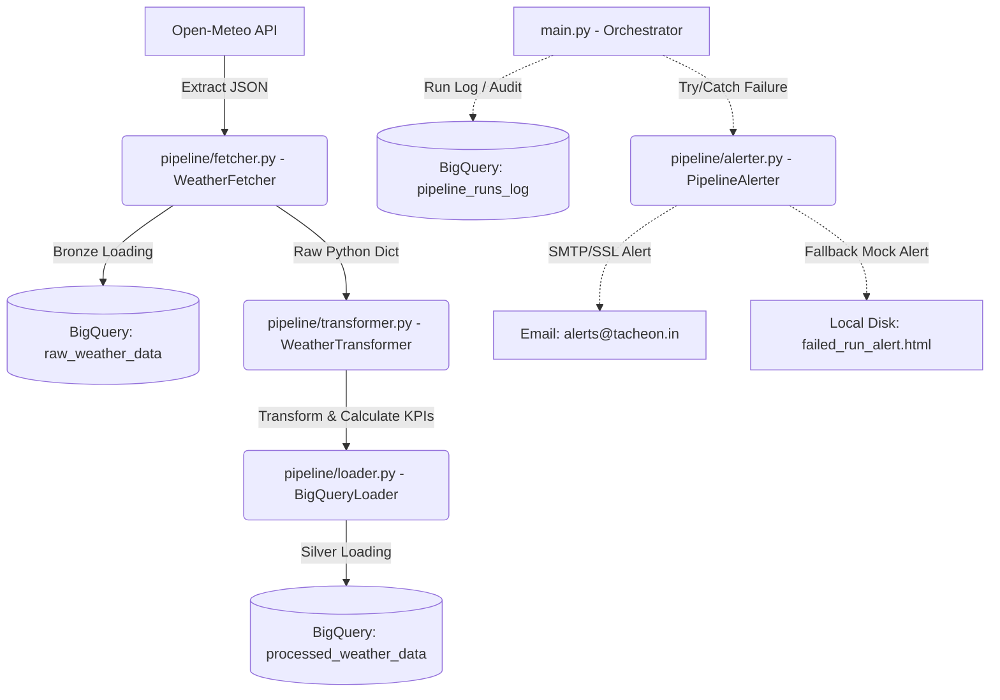

# 🌤️ Weather-Triggered Marketing Ingestion ETL Pipeline

A production-grade, highly resilient data pipeline designed to extract raw weather telemetry from the public **Open-Meteo API**, clean and transform it, calculate real-feel thermodynamic heat indexes and diurnal amplitude volatility, and load the dataset into **Google BigQuery Sandbox**. The pipeline drives dynamic ad-targeting triggers based on actual environmental stress.

---

## 🏗️ Architectural Topology

The pipeline follows a modular **Bronze-to-Silver** data lakehouse design pattern, fully orchestrated with a global exception catcher and automated SMTP alerting:



---

## 📁 Repository Blueprint

```text
task2-pipeline-building/
├── config.py                 # Central Logging, BQ Dataset/Tables, SMTP & Coordinates Config
├── main.py                   # Orchestrator entrypoint with robust try-except error catching
├── requirements.txt          # Production version-constrained python dependencies
├── pipeline/
│   ├── __init__.py           # Explicit package interface exports
│   ├── fetcher.py            # API Extraction service with Session pooling & backoff retries
│   ├── transformer.py        # Flat JSON transformer & Apparent Temp / Volatility KPI generator
│   ├── loader.py             # BigQuery Dataset/Table manager & Batch Ingestion routine
│   └── alerter.py            # Responsive HTML email transmitter with local disk backup fallback
└── queries/
    └── summary.sql           # Analytics view query calculating weather ad-targeting triggers
```

---

## 🚀 Execution & Setup Guide

### 1. Environment Setup

Initialize a clean virtual environment and install the required production-grade dependencies:

```bash
# 1. Create a virtual environment
python -m venv .venv

# 2. Activate the virtual environment
# On Windows:
.venv\Scripts\activate
# On Linux/macOS:
source .venv/bin/activate

# 3. Install dependencies
pip install -r requirements.txt
```

### 2. Configure Environment Variables

Create a `.env` file in the root directory `task2-pipeline-building/` to define your environment parameters:

```env
# GCP Configs
GCP_PROJECT_ID="your-gcp-project-id"
BQ_DATASET="weather_triggered_marketing"

# Alerting SMTP Configs (Optional: Fallback mock html is generated if not provided)
SMTP_SERVER="smtp.gmail.com"
SMTP_PORT=587
SMTP_USER="pipeline-alerts@yourdomain.com"
SMTP_PASSWORD="your-secure-smtp-app-password"
ALERT_RECEIVER_EMAIL="alerts-team@tacheon.in"
ALERT_SENDER_EMAIL="weather-etl-alerts@yourdomain.com"
MOCK_ALERTING="true"
```

### 3. Running the Pipeline

The pipeline supports both **automated recent history backfills (default last 7 days)** and **parameterized custom range execution**:

```bash
# Option A: Run for default range (Last 7 days to Today)
python main.py

# Option B: Run custom date range backfill
python main.py --start-date 2026-05-01 --end-date 2026-05-15
```

---

## 💾 BigQuery Table Schemas

The pipeline automatically asserts and dynamically builds the BigQuery Sandbox structures on startup:

### 1. `raw_weather_data` (Bronze Landing Zone)
| Field Name | Data Type | Mode | Description |
| :--- | :--- | :--- | :--- |
| `extracted_at` | TIMESTAMP | REQUIRED | Date and time the API extraction took place. |
| `latitude` | FLOAT | REQUIRED | Latitude coordinate of the target marketing hub. |
| `longitude` | FLOAT | REQUIRED | Longitude coordinate of the target marketing hub. |
| `raw_payload` | STRING | REQUIRED | Raw, unmodified hourly JSON API response string. |

### 2. `processed_weather_data` (Silver Analytical Zone)
| Field Name | Data Type | Mode | Description |
| :--- | :--- | :--- | :--- |
| `timestamp` | TIMESTAMP | REQUIRED | Hourly reading date and time in UTC. |
| `latitude` | FLOAT | REQUIRED | Latitude coordinate. |
| `longitude` | FLOAT | REQUIRED | Longitude coordinate. |
| `timezone` | STRING | NULLABLE | Location timezone. |
| `temperature` | FLOAT | NULLABLE | Dry-bulb temperature (°C) at 2m. |
| `relative_humidity` | FLOAT | NULLABLE | Relative humidity (%) at 2m. |
| `precipitation` | FLOAT | NULLABLE | Precipitation depth (mm). |
| `wind_speed` | FLOAT | NULLABLE | Wind speed (km/h) at 10m. |
| `apparent_temperature`| FLOAT | NULLABLE | Thermodynamic "real-feel" temperature (°C). |
| `daily_temperature_amplitude`| FLOAT | NULLABLE | Diurnal temperature spread (Daily Max - Min °C). |

### 3. `pipeline_runs_log` (Metadata/Audit Run Ledger)
| Field Name | Data Type | Mode | Description |
| :--- | :--- | :--- | :--- |
| `run_id` | STRING | REQUIRED | Unique execution UUID. |
| `started_at` | TIMESTAMP | REQUIRED | Timestamp when the pipeline execution started. |
| `completed_at` | TIMESTAMP | NULLABLE | Timestamp when the pipeline execution ended. |
| `status` | STRING | REQUIRED | Outcome state: `SUCCESS` or `FAILED`. |
| `records_extracted` | INTEGER | NULLABLE | Total records extracted from Open-Meteo. |
| `records_loaded` | INTEGER | NULLABLE | Total records written to processed table. |
| `error_message` | STRING | NULLABLE | Exception traceback message if job failed. |

---

## 📊 SQL Analytics Layer & Triggers

The `queries/summary.sql` file aggregates hourly logs into actionable daily summaries and applies semantic ad-triggers for specific marketing programs:

### Sample Analytics Output Schema
Executing the analysis script yields aggregated data formatted for analytics dashboard ingestion:

| weather_date | latitude | longitude | location_timezone | avg_temperature | max_apparent_temperature | diurnal_temperature_amplitude | trigger_extreme_heat_ads | trigger_umbrella_ads | trigger_layering_apparel_ads |
| :--- | :--- | :--- | :--- | :--- | :--- | :--- | :--- | :--- | :--- |
| 2026-05-27 | 40.7128 | -74.0060 | EST | 28.45 | 32.10 | 11.20 | `FALSE` | `FALSE` | `FALSE` |
| 2026-05-27 | 51.5074 | -0.1278 | GMT | 14.20 | 12.00 | 5.40 | `FALSE` | `TRUE` | `FALSE` |
| 2026-05-27 | 35.6762 | 139.6503 | JST | 36.80 | 41.50 | 14.80 | `TRUE` | `FALSE` | `TRUE` |

---

## 🚀 Production Blueprint (Scheduling, Alerting & 10x Scaling)

### 1. Robust Orchestration with Apache Airflow
In a production ecosystem, this pipeline is deployed inside a containerized Airflow operator. Below is the production-ready Airflow DAG structure:

```python
from datetime import datetime, timedelta
from airflow import DAG
from airflow.operators.bash import BashOperator

default_args = {
    "owner": "data-engineering",
    "depends_on_past": False,
    "start_date": datetime(2026, 1, 1),
    "email": ["alerts-team@tacheon.in"],
    "email_on_failure": True,
    "email_on_retry": False,
    "retries": 2,
    "retry_delay": timedelta(minutes=5),
}

with DAG(
    "weather_triggered_marketing_pipeline",
    default_args=default_args,
    description="Daily ingestion of Open-Meteo weather logs for marketing triggers",
    schedule_interval="0 4 * * *",  # Runs daily at 04:00 AM UTC
    catchup=False,
    max_active_runs=1,
) as dag:

    run_etl = BashOperator(
        task_id="run_weather_etl",
        bash_command="cd /app && python main.py",
        env={
            "GCP_PROJECT_ID": "tacheon-prod",
            "BQ_DATASET": "weather_triggered_marketing",
            "MOCK_ALERTING": "false"
        }
    )
```

### 2. Enterprise Alert Routing (PagerDuty & Slack Integration)
Instead of plain SMTP, enterprise deployments route alerts dynamically using incident response frameworks:
- **Critical Failures**: Sent directly to **PagerDuty** via the events API to trigger an on-call response for pipeline blockages.
- **Informational/Status Alerts**: Sent to dedicated **Slack channels** (`#ops-data-pipeline`) using webhook URLs to report overall loading states, run counts, and warnings.

### 3. Scaling to 10x Volume (High-Volume BigQuery Architecture)
When expanding from 4 marketing hubs to **thousands of regions globally**, we implement the following BigQuery optimization designs:
1. **Partitioning**: Partition the `processed_weather_data` table by **`timestamp` (Day-based)**. This prevents full table scans when querying recent marketing slots, dropping query costs by over 90%.
2. **Clustering**: Cluster tables by **`latitude` and `longitude`**. Since location is the primary search filter for marketing servers, clustering physical layout optimizes spatial search queries.
3. **High-Throughput Loading**: Move from JSON batch files to **BigQuery Storage Write API** or utilize **Apache PySpark** running on GCP Dataproc to process large spatial inputs in parallel before running load jobs.

---

## 📊 Power BI Connection & Free Hosting Guide

To build a professional client experience, connect your **Power BI Desktop** client to BigQuery and host the report freely in the cloud.

### 🔗 Live Interactive Dashboard
> [!TIP]
> Once you complete the steps below to host your dashboard, replace this placeholder link with your live URL:
> **[👉 View Live Power BI Interactive Dashboard](https://app.powerbi.com/view?r=YOUR_FREE_PUBLISHED_REPORT_LINK_HERE)**

---

### Step 1: Connect Power BI to Google BigQuery
1. Open **Power BI Desktop** on your computer.
2. Click **Get Data** (Home ribbon) ➡️ select **Database** ➡️ **Google BigQuery** ➡️ click **Connect**.
3. Sign in using your GCP email: **`sumithramani8@gmail.com`**.
4. In the Connection window:
   - Select **Import** (Best performance for sandbox environments).
   - Click **Advanced options**.
   - Copy the SQL query from [queries/summary.sql](file:///c:/Users/msumithra/Documents/tacheon-assessment/task2-pipeline-building/queries/summary.sql) and paste it under **SQL statement** to retrieve pre-calculated marketing triggers automatically.
5. Click **OK** ➡️ click **Load** to ingest the data into your Power BI model.

---

### Step 2: Build the Visualizations
Use the loaded columns to create high-value visuals:
- **Map View**: Plot `latitude` and `longitude` to show target marketing hubs.
- **KPI Cards**: Show counts of `trigger_extreme_heat_ads`, `trigger_umbrella_ads`, and `trigger_layering_apparel_ads`.
- **Trend Charts**: Display apparent temperatures and temperature amplitude over time.

---

### Step 3: Host the Dashboard Freely (Publish to Web)
Microsoft allows publishing reports to the cloud for free using a personal workspace:
1. In Power BI Desktop, click **Publish** (Home ribbon).
2. Save your file locally, then log in using your Power BI account.
3. Select **My Workspace** as the destination (My Workspace is 100% free and private to you).
4. Go to **[https://app.powerbi.com/](https://app.powerbi.com/)** and log in.
5. Open your report under **My Workspace**.
6. Click **File** (top menu) ➡️ **Embed report** ➡️ **Publish to Web (Public)**.
7. Click **Create embed code** ➡️ **Publish**.
8. Copy the **Link you can send in email** and paste it directly into the **Live Interactive Dashboard** placeholder link above!

